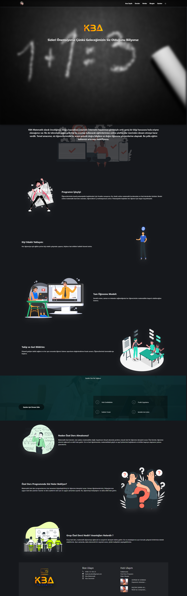
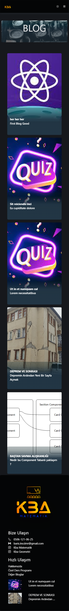
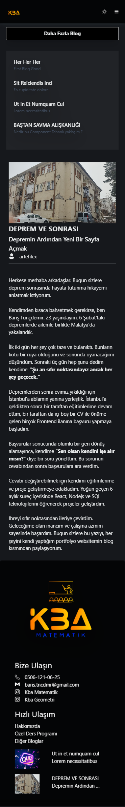
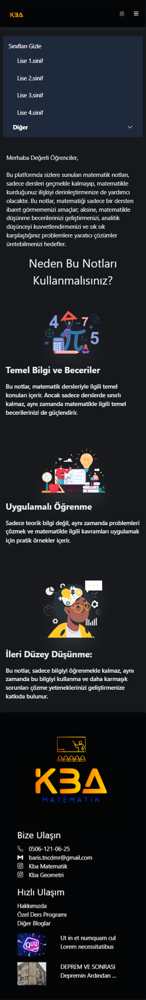
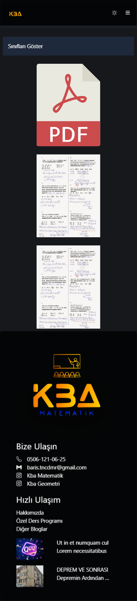
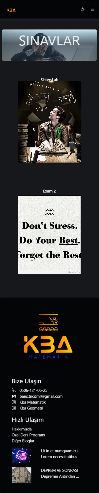
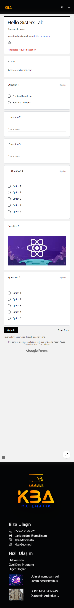

# KBA MATH

KBA MATH, Matematik öğretmenleri ve öğrencileri için özel olarak tasarlanmış interaktif bir matematik öğrenme platformudur. Temel düzeyde Öğretmenin Özel Ders , Blog ,Not ve Sınavlae oluşturup yönetebileceği bir platformdur.

---

<a href="https://www.youtube.com/watch?v=2-l3-1NyPHc" style="display: flex; align-items:center; justify-content:center">
  
</a>


## Kurulum

Proje bağımlılıklarını yönetmek için [Yarn](https://yarnpkg.com/) kullanıyoruz. Proje dosyalarını yerel makinenize kopyalayın ve aşağıdaki adımları izleyerek projeyi başlatın:

### Client Kurulum

1. [Client](./client/) tarafında gerekli bağımlılıkları yüklemek için terminal veya komut istemcisine şu komutu yazın:

```bash
yarn install
```

2. Server da bir adet `.env` oluşturun ve içerisini bu şekilde güncelleyin.

```plaintext

VITE_BASE_URL=http://localhost:4000
```

3. Client Tarafında Projeyi başlatmak için şu komutu kullanın:

```bash
  yarn dev
```

### Server Kurulum

1. [Server](./server/) tarafında gerekli bağımlılıkları yüklemek için terminal veya komut istemcisine şu komutu yazın:

```bash
yarn install
```

2. Server da bir adet `config.env` oluşturun Mysql WorkBanch üzerindeki kullanıcı bilgilerinizi kullanarak bilgilerinizi boş bırakılan yerlere göre güncelleyin.

```plaintext

DB_PASSWORD=******** //
DB_DATABASE=sisterslab
DB_USER=root
DB_HOST=localhost

SECRETKEY="absr"
```

3. Server Tarafında Projeyi başlatmak için şu komutu kullanın:

```bash
  yarn start
```

Tarayıcınızda `http://localhost:3000` adresine giderek projeyi görüntüleyebilirsiniz.

---

## Kullanım Kılavuzu

KBA MATH, matematik öğretmenlerine ve öğrencilere interaktif matematik dersleri, öğrenme notları ve pratik matematik soruları sunar. Ana özellikler şunlardır:

---

### Kulanıcılar İçin

- **Ana Sayfa:** Öğrenciler için, statik veriler kullanılarak oluşturulmuş olan KBA Math'in amacını açıklayan yönergeler bulunmaktadır.
- **Dersler:** Öğrencilerin, öğretmenler tarafından oluşturulan özel ders içeriklerine ulaşmalarını sağlar.
- **Notlar:** Öğrencilerin, öğretmenler tarafından oluşturulan sınıflara göre kategorize edilmiş notlara ulaşıp indirebilmelerini sağlar.
- **Bloglar:** Öğretmenlerin ürettiği blog içeriklerinin yer aldığı bileşendir.
- **Sınavlar:** Öğrenciler için konulara özel interaktif matematik sorularının gösterildiği yerdir.

### Öğretmenler için

1. http://localhost:5173/register adresine giderek ilk kullanıcıyı oluşturduktan sonra bu kullanıcı database superAdmin ve admin olarak kaydedilir.
2. Sonrasında oluşturulan kullanıcılar superAdmin ve admin parametesine sahip olan bu kullanıcı tarafından kontrol edilir .
3. superAdmine sahip bir kullanıcı diğer kullanıcıları kontrol edebilir gerekli yetkinlikleri verebir.
4. register da oluşturulan user kaydı direkt http://localhost:5173/login yönlendirilir eğer minimum isAdmin değeri superAdmin tarafından sağlanmışsa kullanıcı başarılı şekilde admin paneline giriş yapabilir.
5. yukarıdaki 4. ve 5. yönergeler ilk kullanıcı kaydı sonrası için geçerlidir.

#### SuperAdmin Yetkileri

1. Her panel altında Öğretmenin Crud İşlemlerini gerçekleştirmesini sağlayan özelleştirilmiş bileşenler yer alır
2. Herhangi bir Panel Altında eklenen eleman sonrası, editleme , listeleme ve delete işlemlerini gerçekleştirilebilir.
3. Her panel altında oluşturulan yeni bir kayıt için dosya bekleniyorsa yüklenmesi gerekir. Ancak Editleme sırasında tekrardan yeni bir dosya yüklemeye ihtiyaç yoktur.

- **Blog Panel:** Blog işlemleri için kullanılır
- **Özel Ders Panel:** Özel Ders işlemleri için kullanılır
- **Quiz Panel:**

1. Sınavları oluşturmak için kullanılır
2. Google formlar için optimize edilmiştir
3. form yüksekliği ve sınav linki Google Form tarafından alınması gerekir.

- **Class Panel:**

1. Özelleştirilmiş notlar paylaşmak için oluşturulmuştur.
2. Temel amacı Default Sınıf değerleri dışında özel sınıflar eklememize yarar.

- **Category Panel:**

1. Kategori oluşturmak için kullanılan yönetim panelidir.
2. Not oluşturmak için Gerekli bir parametredir.
3. Kategori oluşturmadan not eklemesi yapılamaz.

- **Not Panel:** Notlar şöşn kullanılan yönetim panelidir.
- **User Panel:**

1. SuperAdmin için useların listelendiği editlendiği paneldir.
2. sadece isAdmin değerine sahip kullanıcılar için kendini görebildiği editleyebildigi paneldir.

#### Sadece isAdmin parametsenine sahipler için

Şuanlık tek yetkinliği; Blog ekleme editleme silme işlemleri gerceklestirmek aynı zamanda kendi bilgilerini güncellemek .

---
## Örnek Kullanım 


 <h1> Ana Sayfa </h1>
<div style="display: flex; flex-direction: row; align-items: flex-start; justify-content: center; width: 100% ; gap: 2rem">
 
</div>
<br/><br/><br/>
<h1> Özel Ders | Özel Ders Detay </h1>
<div style="display: flex; flex-direction: row;  align-items: flex-start; justify-content: center;  width: 100% ; gap: 2rem"> 
  
 
 </div> 

<h1> Bloglar | Blog Detay </h1>
<div style="display: flex; flex-direction: row;   align-items: flex-start; justify-content: center; width: 100% ; gap: 2rem"> 
  
 
 </div>

<h1> Notlar | Not Detay </h1>
<div style="display: flex; flex-direction: row; align-items:flex-start; justify-content: center;  width: 100% ; gap: 2rem"> 
  
 
 </div>

<h1> Quizler | Quiz Detay </h1>
<div style="display: flex; flex-direction: row;  align-items:flex-start; justify-content: center;  width: 100% ; gap: 2rem"> 
  
 
 </div>